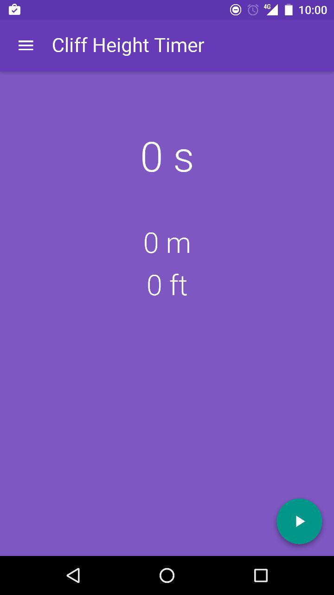

# Cliff-Height-Timer 

This is a very simple app that uses basic physics to tell you the height of a cliff or the depth of a well. All you do is time how long it takes for the object to hit the ground and let science do the rest. You can even measure the height of a cliff from the ground if you throw a rock right up to the top and start timing at the apex.

## Preview



## Install (can take a while)

```
npm install
```

## Start

```
npm start
```

## Build (To be hosted on Nginx, Apache, any Webserver)

```
npm build
```
